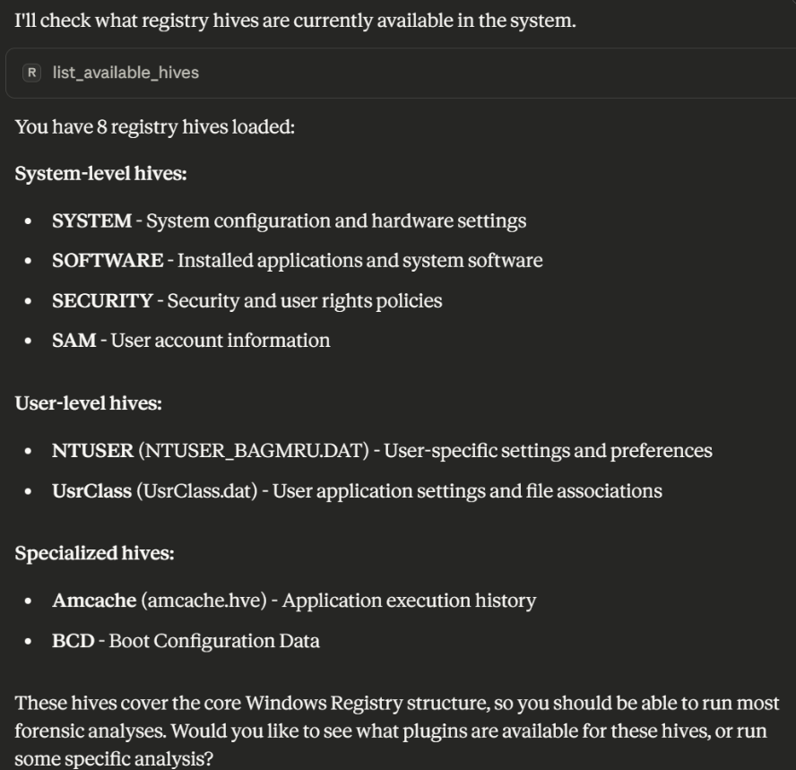
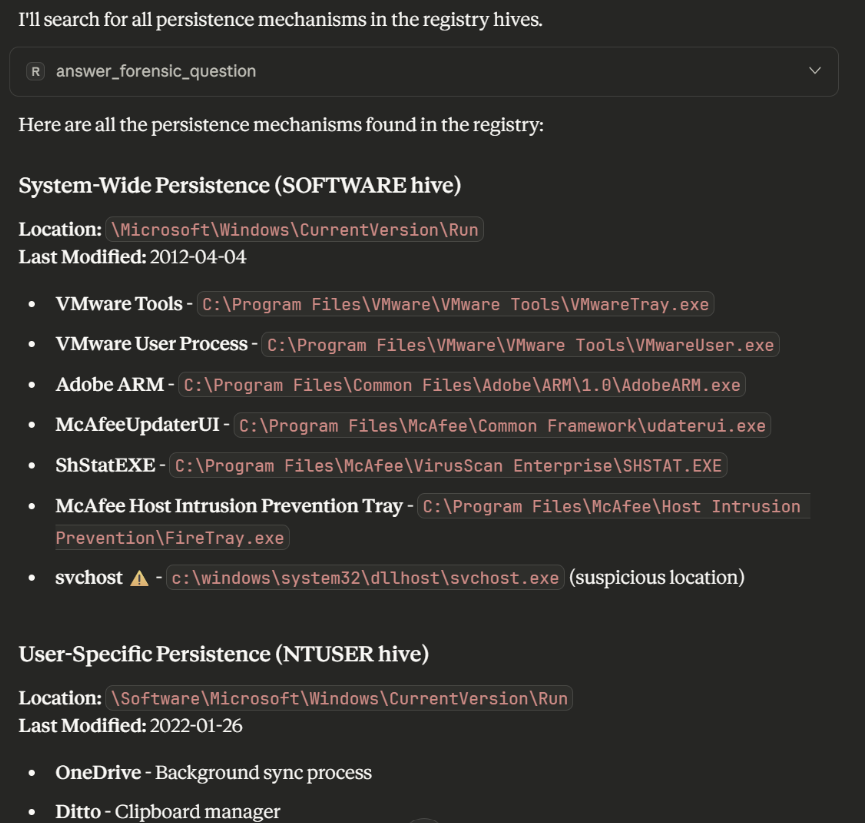
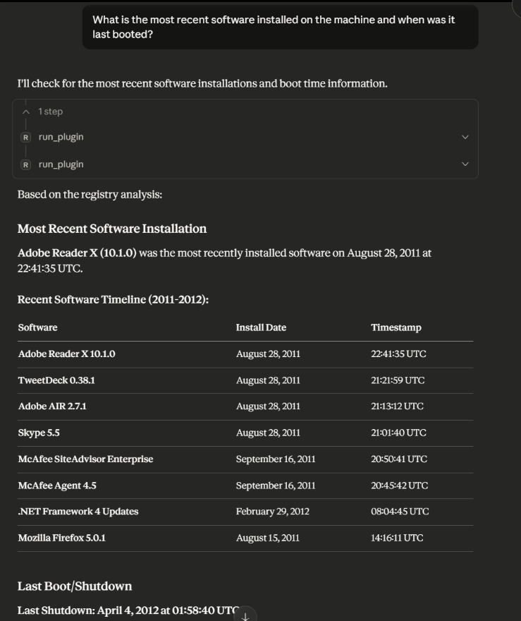

# Regipy MCP Server

**Windows Registry Analysis for Claude Desktop**

Enable Claude to analyze Windows registry hives and answer forensic questions in natural language.

## Quick Start (Windows)

### 1. Configure Claude Desktop

Edit `%APPDATA%\Claude\claude_desktop_config.json`:

```json
{
  "mcpServers": {
    "regipy": {
      "command": "C:\\Users\\YourUsername\\anaconda3\\envs\\regipy\\python.exe",
      "args": [
        "path\\to\\regipy_mcp_server\\server.py",
        "--hives-dir",
        "C:\\path\\to\\your\\hives"
      ]
    }
  }
}
```

### 2. Restart Claude Desktop
Completely quit and restart Claude Desktop (right-click tray icon → Quit)

### 3. Test It
Ask Claude: **"What registry hives are available?"**

## Demo: Claude Desktop in Action

### Example 1: Listing Available Hives

**Question:** "What registry hives are currently available in the system?"

**Claude's Response:**



Claude automatically:
- Called the `list_available_hives` MCP tool
- Categorized 8 hives by type (SYSTEM, SOFTWARE, NTUSER, SAM, etc.)
- Explained what each hive contains

### Example 2: Finding Persistence Mechanisms

**Question:** "What are the persistence mechanisms?"

**Claude's Response:**



Claude automatically:
- Called the `answer_forensic_question` tool
- Ran both SOFTWARE and NTUSER persistence plugins
- Found VMware Tools, Adobe ARM, McAfee components
- Flagged suspicious entry: `svchost` in an unusual location
- Organized results by system-wide vs user-specific

### Example 3: Recent Software and Boot Time

**Question:** "What is the most recent software installed on the machine and when was it last booted?"

**Claude's Response:**



Claude automatically:
- Ran `installed_programs_software` plugin
- Ran `shutdown` plugin
- Found Adobe Reader X (10.1.0) was most recent (Aug 28, 2011)
- Showed full software timeline
- Reported last shutdown: April 4, 2012

## What You Can Ask

**System Information:**
- "What is the hostname?"
- "What is the timezone?"
- "What is the Windows version?"

**Security & Forensics:**
- "What are the persistence mechanisms?"
- "What user accounts exist?"
- "What services are configured?"

**User Activity:**
- "What USB devices were connected?"
- "What programs are installed?"
- "What files were recently accessed?"

**Investigation:**
- "What programs have been executed?"
- "Show me the network configuration"
- "When was the system last booted?"

## How It Works

1. **Auto-discovers** registry hives from a directory
2. **Auto-loads** 75+ regipy plugins
3. **Maps** natural language questions to the right plugins
4. **Returns** structured forensic data to Claude

## Files

- `server.py` - Main MCP server (530+ lines)
- `README.md` - This file
- `claude_desktop_config.example.json` - Configuration template
- `test_local.py` - Test the server without Claude Desktop
- `screenshots/` - Demo screenshots from Claude Desktop

## Requirements

- Python 3.8+ (conda environment recommended)
- regipy >= 6.0.0
- mcp >= 1.0.0
- Claude Desktop app
- Windows registry hive files

## Configuration

The server accepts the hives directory via:
1. **Command-line argument** (recommended): `--hives-dir C:\path\to\hives`
2. **Environment variable**: `REGIPY_HIVE_DIRECTORY=C:\path\to\hives`
3. **MCP tool**: Call `set_hive_directory` from Claude at runtime

## Supported Hive Types

- **SYSTEM** - Computer name, timezone, services, USB devices, network config (28 plugins)
- **SOFTWARE** - Windows version, installed programs, persistence (21 plugins)
- **NTUSER** - User activity, recent docs, typed URLs, UserAssist (21 plugins)
- **SAM** - User accounts, password hashes (2 plugins)
- **SECURITY** - Domain SID (1 plugin)
- **AMCACHE** - Application execution history (1 plugin)
- **USRCLASS** - Shell bags (1 plugin)
- **BCD** - Boot configuration (1 plugin)

Total: **75+ plugins** for comprehensive forensic analysis

## Architecture

```
Claude Desktop
    ↓ (MCP Protocol)
Regipy MCP Server
    ↓ (Auto-discovers)
Registry Hives → 75 Plugins → Structured Results
    ↓
Claude presents findings in natural language
```

## Troubleshooting

### Server not connecting?
1. Run `test_local.py` to verify the server works
2. Check config file location: `%APPDATA%\Claude\claude_desktop_config.json`
3. Ensure you completely quit Claude Desktop (not just closed window)
4. See `docs/WINDOWS_SETUP.md` for detailed troubleshooting

### No hives loaded?
1. Verify hive directory exists and contains hive files
2. Check paths use double backslashes in JSON: `C:\\path\\to\\hives`
3. Make sure hive files aren't corrupted

## License

Uses the regipy library for registry parsing. Designed for authorized forensic analysis only.

## Credits

- Built on [regipy](https://github.com/mkorman90/regipy) by Martin Korman
- Uses [Model Context Protocol](https://modelcontextprotocol.io/) by Anthropic
- Designed for [Claude Desktop](https://claude.ai/download)
